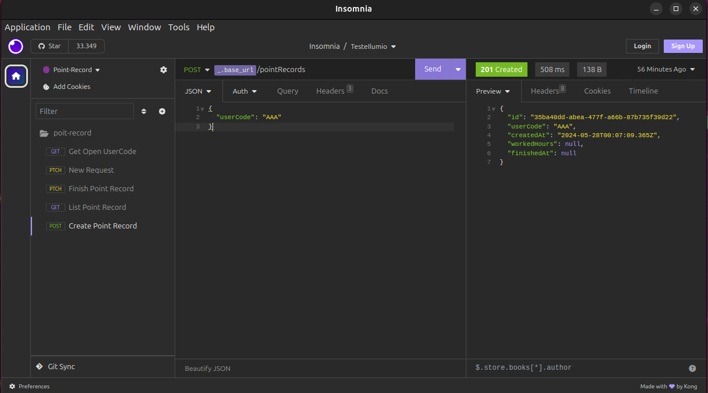
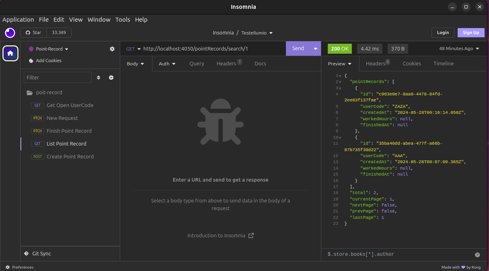
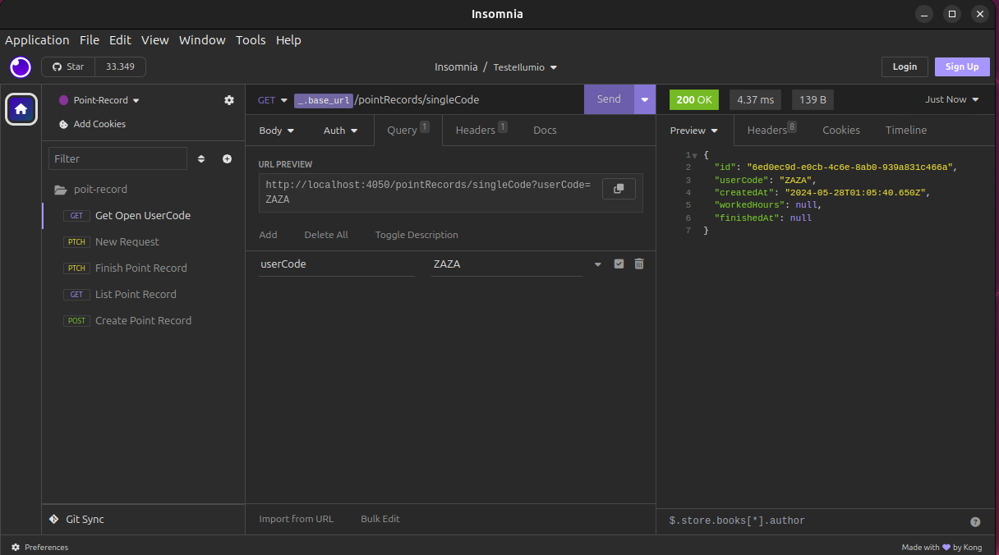
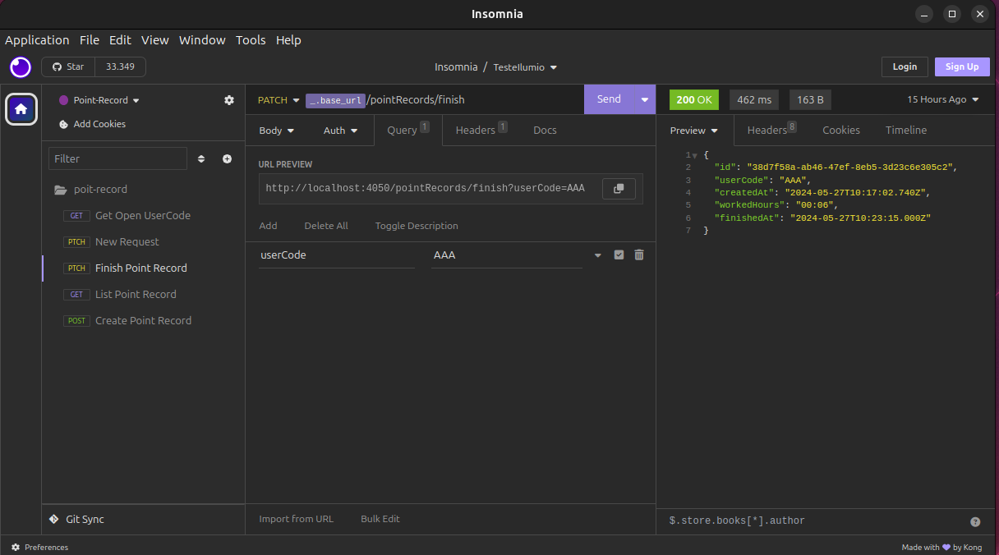

## Description

## Installation

```bash
$ npm install ou yarn
```

## Running the app

# watch mode
npm run start:dev ou yarn start:dev

### Criar container imagem postgresql no docker , informar no terminal do projeto
docker compose up -d 

ou 

make up

### Criar container imagem projeto no docker , informar no terminal do projeto
docker-compose -f docker-compose-backend.yaml up -d

ou 

make backend

#### caso a pasta dados_postgresql estiver protegida, quando criar a imagem do backend favor rodar o comando.
 sudo chmod -R 777 dados_postgresql
 
 #### roda novavente o comando make
  make backend


## imagem dos endpoint da API 
<p>Criar registros de ponto</p
<p align="center">

</p>
<p>Lista registros de ponto</p
<p align="center">

</p>
<p>Pesquisa registros de ponto em aberto</p
<p align="center">

</p>
<p>Finaliza registros de ponto</p
<p align="center">

</p>
